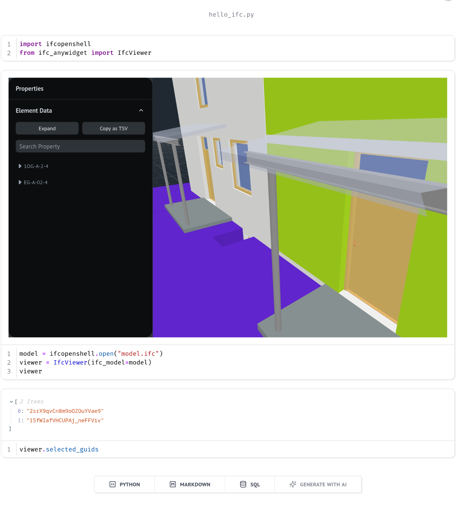

# IFC viewer anywidget

Display a IFC model in your Jupyter/marimo notebook.

Uses [anywidget](https://anywidget.dev/) and [Open BIM components from That Open Company](https://thatopen.com/)

>[!WARNING]
> this library is still in early development and only covers a fraction of the capabilities of Open BIM Components



## install

If you're running JupyterLab, add the library to your environment:

```shell
pip install ifc-anywidget
```

If you're using marimo in sandbox mode, just start using it! marimo will detect the import and ask you to install the package.

## usage

```
from ifc_anywidget import IfcViewer
import ifcopenshell

model = ifcopenshell.open("my-awesome-model.ifc")
viewer = IfcViewer(ifc_model=model)
viewer
```
