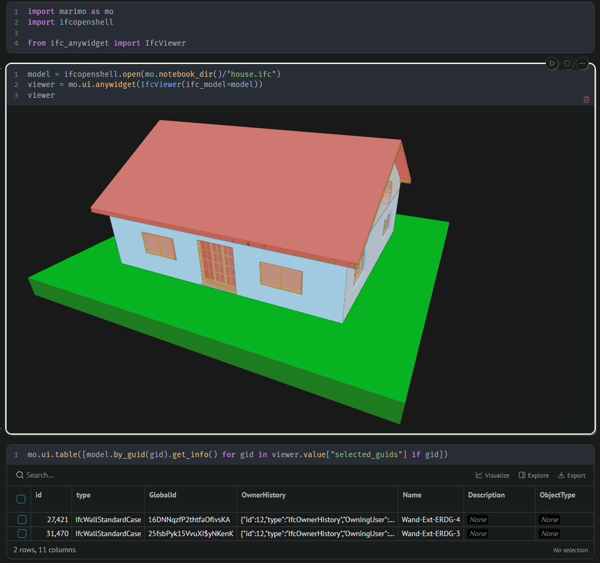

# IFC viewer anywidget

Display an IFC model in your Jupyter/marimo notebook.

Uses [anywidget](https://anywidget.dev/) and [IFCLite](https://louistrue.github.io/ifc-lite/)

- Displays an `ifcopenshell.file` object using the IFCLite viewer
- returns the list of `GlobalId`s of the selected elements via `selected_guids` attribute 



## install

If you're using marimo in sandbox mode, skip this part.
Marimo will detect the import and ask you to install the package.

If you're running JupyterLab, add the library to your environment:

```shell
pip install ifc-anywidget
```

if you're using uv (highly recommended), run

```shell
uv add ifc-anywidget
```

## usage

```
from ifc_anywidget import IfcViewer
import ifcopenshell

model = ifcopenshell.open("my-awesome-model.ifc")
viewer = IfcViewer(ifc_model=model)
viewer
```

## development

Clone the repo and run `uv sync` to initialize the environment with all the needed dependencies.

For testing within marimo, just run

```shell
uv run marimo edit tests/test_marimo.py
```

For testing within jupyter lab, run

```shell
uv run jupyter lab tests/test_jupyter.ipynb
```
